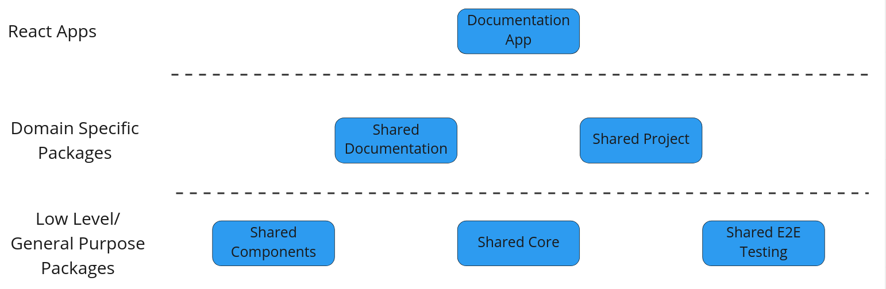

# LCA Collect - Shared Project Library

A shared library for project related components and pages.
This library contains building blocks for dealing with projects, project members and project groups in a React.js app.



## Getting Started

```shell
npm install
```

## Build, Test & Publish

Testing is done with [Vitest](https://vitest.dev/)

```shell
npm run test
```

To publish a new version:

1. Update the version in `package.json` (remember to follow semver)
2. When you're satisfied and ready to publish, then create a PR

## Development Setup with other @lcacollect packages

You can use `npm link` to set up live reloading of the other `@lcacollect` packages.

- Clone the package that you wish to enable live reload on.
- In the terminal, go the root folder of the cloned repo and write `npm link` in the terminal
- Go back to this repo's root folder and write `npm link @lcacollect/{PACKAGE}` to link the package.
- When you make changes to the package, that you wish to see in this app, simply run `npm run build` in the package and
  the changes will available here.

## Folder Structure and Naming

```plaintext
src/ # Contains the source code
    __mocks__/ # Contains the mock data and functions for unit tests
    assets/ # Contains assets, such as images
    components/ # React components
        myComponent/ # Each component has its own folder
            index.ts # Export of what is public
            myComponent.tsx # The component
            myComponent.spec.tsx # Unit test file
    dataAccess/ # Apollo Client folder
        generated.ts # Autogenerated file from Apollo with React Hooks for data fetching
        schema.graphql # File for writing GraphQL queries
    pages/ # Page components
```

## Further Documentation

Further documentation for LCAcollect can be found [here](https://github.com/lcacollect/.github/blob/main/wiki/README.md)

# License

Unless otherwise described, the code in this repository is licensed under the Apache-2.0 License. Please note that some
modules, extensions or code herein might be otherwise licensed. This is indicated either in the root of the containing
folder under a different license file, or in the respective file's header. If you have any questions, don't hesitate to
get in touch with us via [email](mailto:chrk@arkitema.com).